## Under The Sea

Unsplash Clone based UnsplashAPI

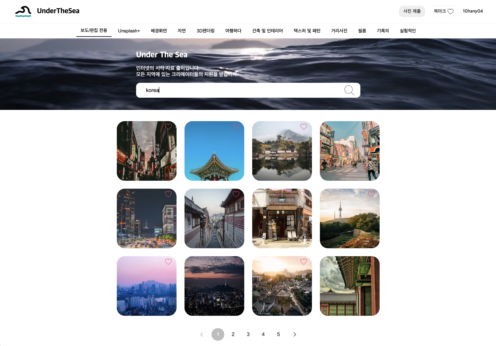

<br />

## Stack

- 코어 : React, TypeScript, React-Router-Dom

- 상태관리 : React-Query

- 데이터페칭: axios

- 스타일링 : Emotion

- 패키지 매니저 : Yarn

- 코드 스타일 : Eslint, Prettier

- 그 외: dayjs, react-loader-spinner, react-error-boundary

<br />

## Specification Details

> 공통

- 사진목록에서 북마크버튼 확인/북마크 상태변경/북마크페이지는 **로그인한 사용자만 가능**합니다.

  - 내비게이션바의 우측 상단 **로그인버튼**을 누르면 Unsplash로그인 페이지로 이동합니다.
  - Unsplash로그인 후 다시 메인페이지로 리다이렉트되고, 내비게이션바의 우측 상단에서 북마크 버튼과 사용자이름이 표시됩니다.

      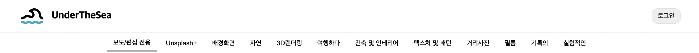
      ⬇
      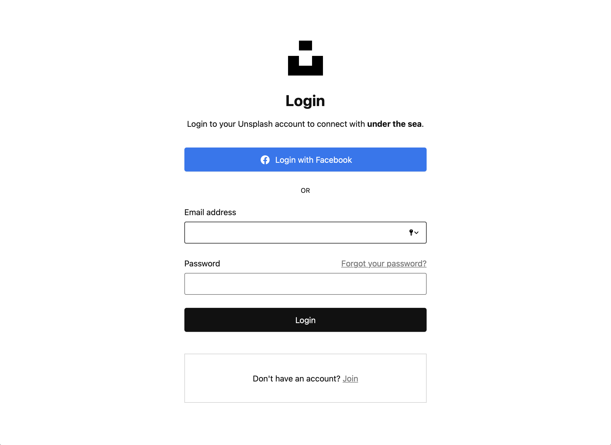
      ⬇
      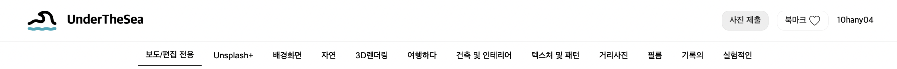

- 에러가 발생한 경우 에러메세지가 포함된 에러페이지를 보여줍니다.

  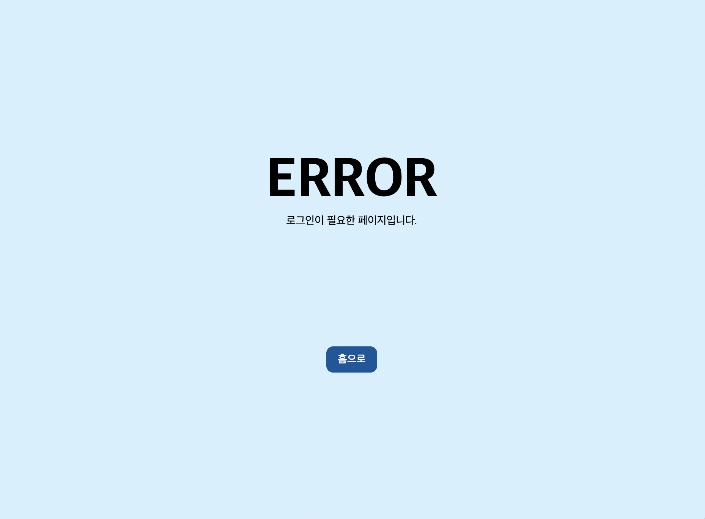

> 상세모달

- 이미지상세 **데이터를 가져오는 동안 로딩스피너**를 보여주고, **데이터가 준비되면 모달을 띄운다.**

  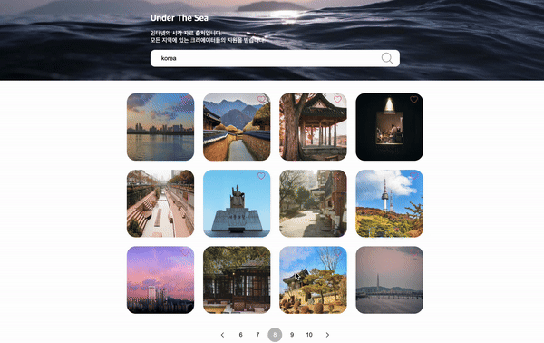

- **검색 목록과 상세모달에서의 북마크 동기화**

  - 검색 목록에서 이미지 상단의 북마크버튼을 클릭하면 ♡ 에서 ♥ 으로 변경되어야 합니다.
  - 해당 이미지의 상세모달을 열었을 때에도 북마크버튼이 ♥ 으로 보여야 합니다.
  - 모달 바깥을 눌러서 상세모달을 닫았을 때, 검색 목록의 해당 이미지에도 북마크버튼이 ♥으로 보여야 합니다.

    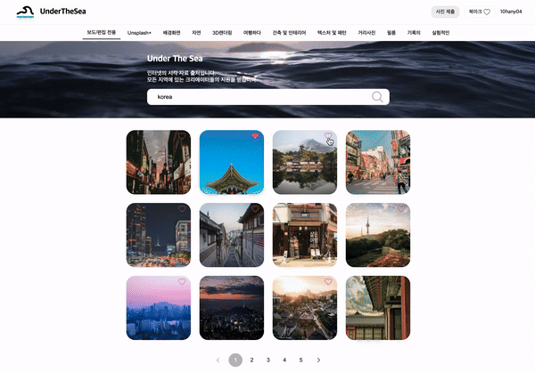

> 메인페이지

- 검색창에 쿼리를 입력할때, **최초 로딩**이라면 스켈레톤 UI 애니메이션이 보여집니다.

    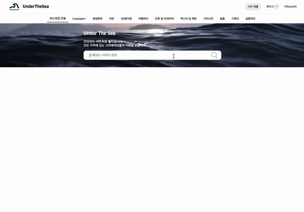

- 북마크 페이지로 이동했다가, 브라우저 뒤로가기를 통해 메인페이지로 되돌아가더라도 **기존 검색 결과를 볼 수 있습니다.**

    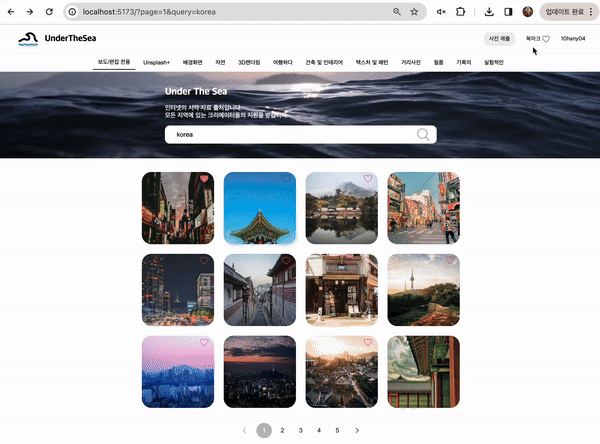

<br />


## Features

> 메인페이지


> 상세모달

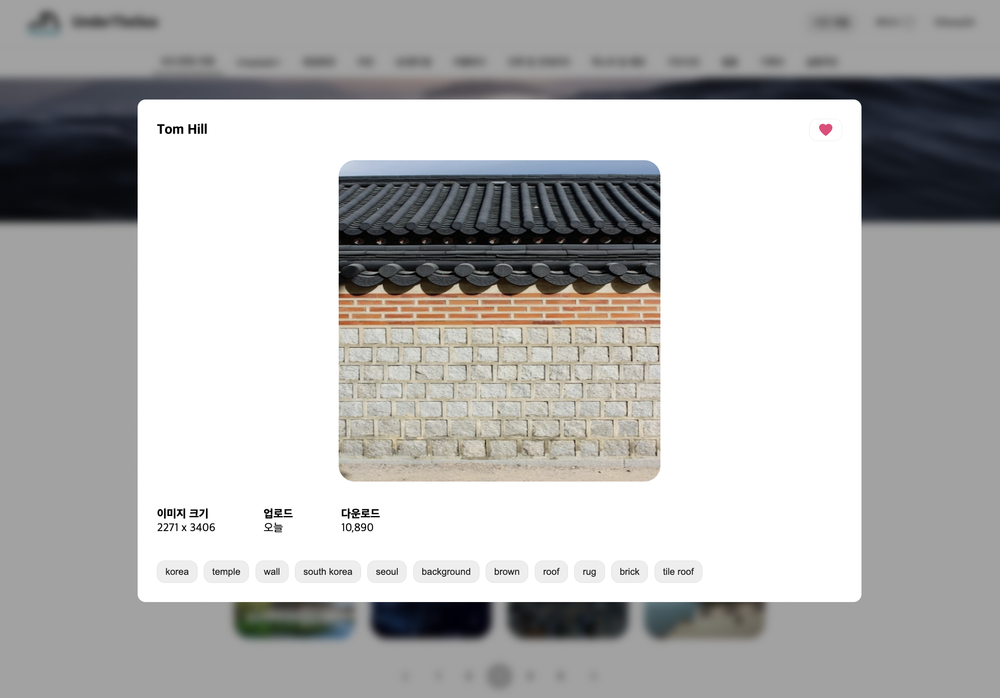

> 북마크페이지

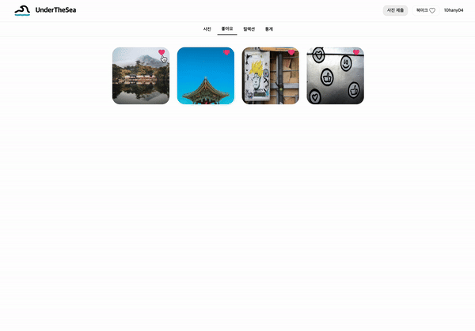

- Unsplash 의 List a user’s liked photos API가 최신데이터로 응답을 보내주지 않는 이슈가 있어서, 북마크페이지의 최신화가 간헐적으로 느리게 반영됩니다. mock API로 확인해본 결과 기능상으로는 문제가 없었습니다.

<br />


## About Development

> **Development Strategy**

- Branch를 나누어 작업
  - feature/setup
    - Directory, Route structure 설계
    - 공통 스타일
    - 공통 컴포넌트
    - type
    - handler 모듈화
  - feature/mainPage
  - feature/likePage
- 공통 컴포넌트와 도메인성격이 강한 컴포넌트를 위계에 맞게 분리
- Authorization Work Flow
  - 로그인 버튼 클릭 > Unsplash 로그인페이지 > 메인페이지로 리다이렉트 > 토큰 요청 > 유저정보
  - 단, refresh시에는 유지되지 않음
  - 로그인한 유저만 북마크 기능 사용 가능
- 데이터페칭 최적화
- 로딩상태 fallback
- ErrorBoudary 에러핸들링
- URL에 현재 검색쿼리 및 페이지 반영

<br />

> **데이터페칭 지연**

검색API 데이터페칭이 완료되어 새로운 검색 결과를 표시할때 레이아웃 시프트가 발생하는 것을 방지하고, 자연스러운 브라우저 렌더링을 위해 스켈레톤 UI를 적용했습니다. 또한 로딩시간을 짧게 체감할 수 있도록 애니메이션을 추가하였습니다.

하지만 로딩시간이 짧을 경우에는 스켈레톤 애니메이션이 플리커링처럼 보일 수 있기 때문에 이를 개선하기 위해, 일정 시간 로딩상태를 유지하는 방법을 고려했습니다. 일정 ms 이후 resolve되는 Promise인 sleep함수를 만들고,
useQuery의 queryFn에서 sleep함수와 데이터페칭함수를 Promise.all을 이용하여 병렬로 실행되게 하였습니다. Promise.all은 모든 프로미스가 완료되는 것을 보장하기 때문에 데이터페칭이 먼저 완료되더라도, sleep함수가 이행되지 않았다면 isLoading은 계속 true가 됩니다. 따라서 isLoading이 유지되는 동안 스켈레톤 애니메이션을 보여주고, Promise 함수들이 모두 resolve되어 로딩상태가 끝났을때 가져온 사진목록을 보여주도록 구현했습니다.

> **데이터페칭 최적화**

검색결과에서 이미지를 클릭하면 모달이 나타나고, 모달에서는 photoId에 대한 데이터를 가져옵니다. 컴포넌트가 마운트된 후 데이터를 가져오는 리액트의 waterfall 문제로 브라우저 렌더링이 지연되기 때문에 사용자는 모달이 열리더라도 잠시 빈화면을 보게 됩니다.

모달에서 스피너를 보여주는 방법도 고려했지만, 사용자 입장에서는 단계가 추가되는 것처럼 보일 수 있기 때문에 데이터가 준비된 다음에 모달을 보여주는 방법을 생각했습니다.
React의 Suspense로 모달과 PhotoDetail컴포넌트를 래핑하였습니다. PhotoDetail컴포넌트에서 데이터페칭이 완료 전까지는 fallback으로 로딩스피너를 보여주고, PhotoDetail컴포넌트에서는 useSuspenseQuery로 데이터페칭이 완료되었다는 것을 React에 알릴 수 있도록 작성했습니다.

첫 번째 모달에서 스피너를 보여주는 방식(`이미지 클릭 > 모달 > 스피너 > 컨텐츠 ; 4단계`)에서, Suspense로 데이터페칭이 완료될 때 모달을 보여주는 방식(`이미지클릭 > 스피너 > 모달/컨텐츠 ; 3단계`)으로 변경함으로써 진입단계와 체감시간을 줄일 수 있었습니다. 또한 데이터가 있다는 것이 보장되어 가독성있게 코드를 작성할 수 있었고, 로딩상태를 외부 fallback에 위임함으로써 데이터로 UI를 그리는 것에만 집중할 수 있었습니다.

<br />

## Installation

**실행 환경**

- nodejs 18.17.1
- 최신 버전의 Chrome

**환경 변수**

- 디렉토리 루트에 `.env.local` 이름의 파일을 생성하고, 다음 환경변수를 입력해 주세요.
- Access Key 와 Secret Key

  Unsplash Account에서 애플리케이션을 생성하고, My Application > keys 의 Access Key 와 Secret Key를 환경변수에 추가합니다.
  [참고: Unsplash 🔗](https://unsplash.com/documentation#registering-your-application)

  ```ts
  VITE_ACCESS_KEY=🔑your Access Key🔑
  VITE_SECRET_KEY=🔑your Secret Key🔑
  VITE_DOMAIN_URL=http://localhost:5173
  VITE_UNSPLASH_BASE_URL=https://api.unsplash.com
  VITE_UNSPLASH_OATH_URL=https://unsplash.com/oauth
  ```

**실행 방법**

- 프로젝트 내부에서 패키지를 설치합니다.
  ```
  $ yarn
  ```
- 로컬 환경에서 개발 서버를 실행합니다.

  ```
  $ yarn dev
  ```

<br />
